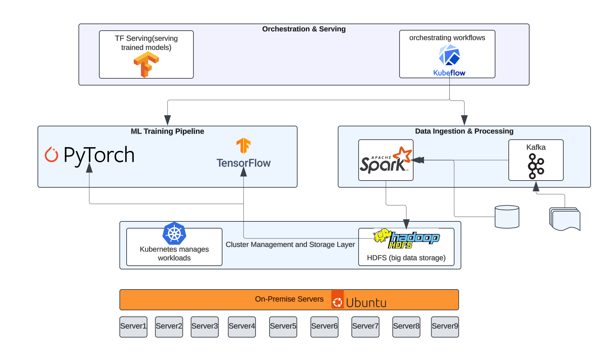

# Kubeflow-Spark Pipeline for On-Premise ML Workflows

This project explores building an **on-premise machine learning pipeline architecture** that integrates data orchestration, real-time ingestion, big data processing, and ML training/serving. It leverages **Kubeflow Pipelines** for orchestration, **Apache Spark** for large-scale data processing, **Kafka** for streaming ingestion, **HDFS** for distributed storage, and **TensorFlow Serving** for deploying ML models.

## Overview

### On-Premise Architecture

The architecture focuses on leveraging on-premise resources to orchestrate and execute data and ML workflows. The design components include:

- **Orchestration and Serving**: Kubeflow Pipelines to manage workflows and TensorFlow Serving for model inference.
- **Data Ingestion and Processing**: Kafka for real-time ingestion and Spark for batch/stream processing.
- **Storage**: HDFS for big data storage (currently simulated with local storage during testing).
- **Infrastructure**: Kubernetes as the container orchestrator, running on Ubuntu-powered on-premise servers.

### Architecture Diagram

  

## Current Status

Currently, the **Spark job on Kubeflow Pipelines** for ingesting and processing weather data is under development, with local testing and validation steps completed. Future steps include integrating HDFS for scalable storage and extending the pipeline to include TensorFlow training/serving.

### Spark Job on Kubeflow Pipelines

- A Spark job has been implemented to process weather data and convert it into Parquet format.
- The Spark job has been tested locally using Docker.
- The job has been integrated into a Kubeflow pipeline, but debugging is ongoing to ensure compatibility and smooth execution.

## Future Steps

1. **Add HDFS** as the primary storage layer for the pipeline.
2. **Integrate Kafka** for real-time ingestion.
3. **Extend the pipeline** to include TensorFlow for training and serving ML models.
